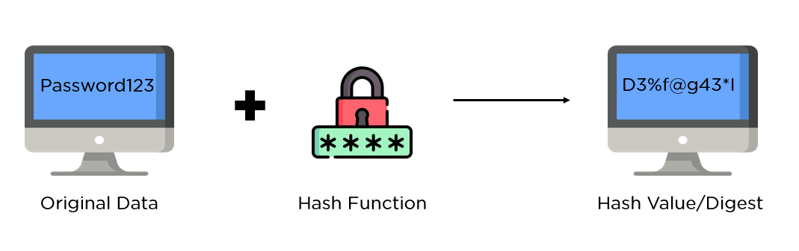

# 📚 MD5 Hashing: A Comprehensive Guide

## 📝 **Table of Contents**

- [Introduction](#introduction)
- [How MD5 Works](#how-md5-works)
- [Applications of MD5](#applications-of-md5)
- [Vulnerabilities and Security Concerns](#vulnerabilities-and-security-concerns)
- [MD5 Algorithm Explained](#md5-algorithm-explained)
- [MD5 Hashing in Different Languages](#md5-hashing-in-different-languages)
  - [Python](#python)
  - [Java](#java)
  - [JavaScript (Node.js)](#javascript-nodejs)
- [Usage in Real-world Applications](#usage-in-real-world-applications)
- [Preventive Measures and Alternatives](#preventive-measures-and-alternatives)
- [References](#references)

---

## 🎯 **Introduction**

MD5 (Message Digest Algorithm 5) is a cryptographic hash function that converts an input message into a fixed-length 128-bit hash value. It is commonly used for verifying data integrity but is no longer considered secure for critical applications due to vulnerabilities such as collision attacks.

---

## ⚙️ **How MD5 Works**

1. **Input Message:** The input can be of any length (text, file, or binary).
2. **Padding:** Padding bits are added to ensure the message length is congruent to 448 modulo 512.
3. **Message Splitting:** The padded message is divided into 512-bit blocks.
4. **Hashing Process:** Each block undergoes a series of transformations using bitwise operations, modular addition, and logical functions.
5. **Output:** A 128-bit (16-byte) hash value is produced.

---

## 📚 **Applications of MD5**

- **File Integrity Verification:** To confirm that a file has not been altered.
- **Digital Signatures:** Ensuring authenticity and integrity.
- **Password Storage:** Though insecure today, MD5 was historically used for storing hashed passwords.
- **Checksums:** Verifying data integrity in network transfers.

---

## ⚠️ **Vulnerabilities and Security Concerns**

- **Collision Attacks:** Two different inputs can produce the same MD5 hash, undermining data integrity.
- **Pre-image Attacks:** Attackers can create a message that hashes to a specific value.
- **Rainbow Table Attacks:** MD5 hashes can be reverse-engineered using precomputed tables.

⚡ **Recommendation:** Avoid using MD5 for cryptographic security purposes. Use more secure algorithms like **SHA-256** or **bcrypt**.

---

## 🧠 **MD5 Algorithm Explained**

1. **Padding:** Append a single 1-bit followed by zeros until the message length is 448 mod 512. Add the length of the original message as a 64-bit integer.
2. **Initialize MD Buffer:** Four 32-bit words initialized as:
