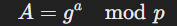
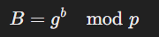
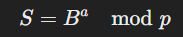
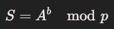

# 🎯 Objective:

To implement a `Diffie-Hellman Key Exchange` mechanism using HTML and JavaScript to demonstrate how two parties can securely share a secret key over a public channel.

## 🔐 What is Diffie-Hellman Key Exchange?

Diffie-Hellman Key Exchange (DHKE) allows two parties (e.g., Alice and Bob) to establish a shared secret key over an insecure channel without directly transmitting the key itself.

## 📚 Key Concepts:

1. Public Parameters:

   - A large prime number `p` and a primitive root `g` (also called the generator).
   - These values are public and known to both parties.

2. Private Keys:

   - Each party (Alice and Bob) chooses a private key (a and b), which is kept secret.

3. Public Keys:

   - Alice computes her public key:
     

   - Bob computes his public key:
     

4. Key Exchange:

- Alice sends `A` to Bob and Bob sends `B` to Alice.

5. Shared Secret:

   - Alice computes:

   

   - Bob computes:

   

Both arrive at the same shared secret `S`!

## 🚀 Final Goal:

- Implement Diffie-Hellman Key Exchange using JavaScript.
- Show how the shared secret is computed securely.
- Explain each part with code.
